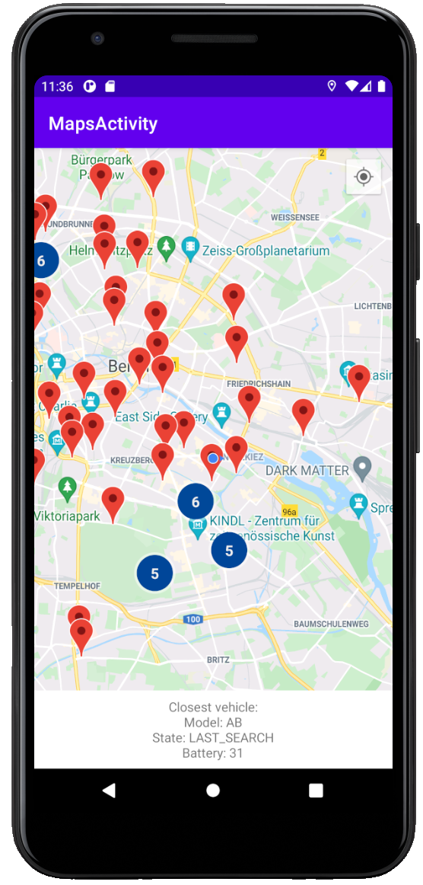

# TierTest, simple map application

This is a simple map application with basic networking, written in kotlin in MVVM pattern.
 
The app allows users to visualise the scooters on a map with simple POIs and Clusters and displays the details of the closest vehicle in a bottom layout. When the user opens the app, it navigates the map-camera to the user's location. The bottom layout is avare of user location changes. 

Build instructions:

Please use the Latest Android Studio with Kotlin plugin to build the application.

You can open the project for the first time as follows:
File -> New -> Import Project -> Select the source folder

Add your api keys to the machine's `gradle.properties` file:

On Windows: `C:/Users/{username}/.gradle/gradle.properties` file:

```
mapApiSecretKey = "your secret key"
mapApiKey = "your maps api key"
```

Now you can build and run the project on a device or on an emulator.

Advice for testing:
- Set your fake location to Berlin centrum!
- Inspect the bottom layout behaviour for location changes, specially when moving close to a new poi.

Used libraries: 
- AndroidX
- Retrofit
- OkHttp3
- Okhttp3:logging-interceptor
- Gson
- RxJava
- Dagger2
- EasyPermissions
- GMS Location
- Android Maps utils
- Mockito
- MockitoKotlin2
- Junit

Sample image of the application: 


